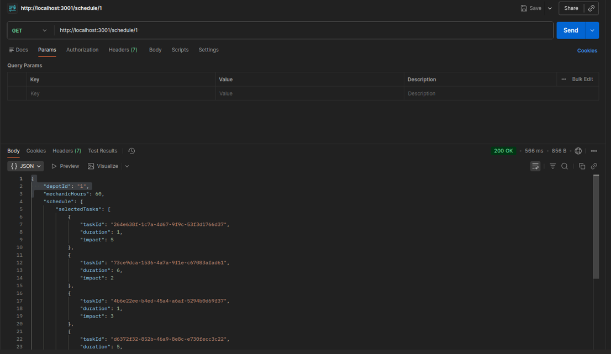
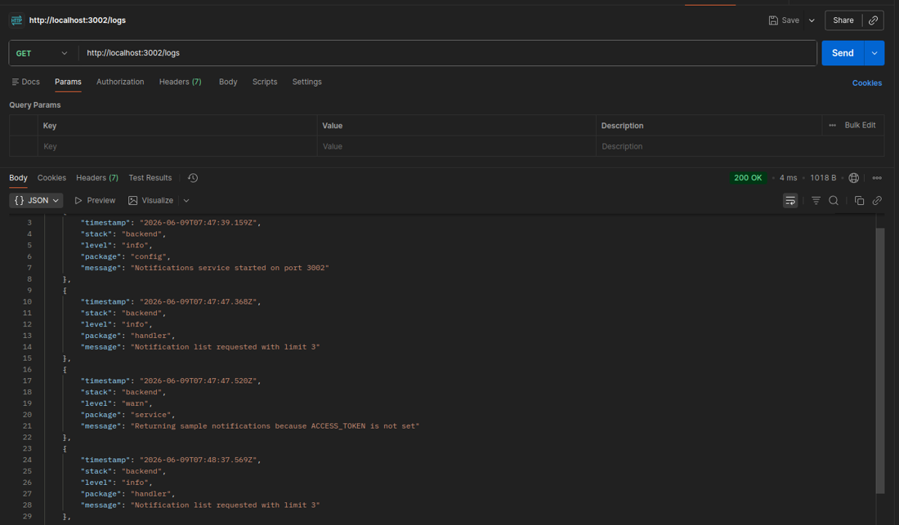
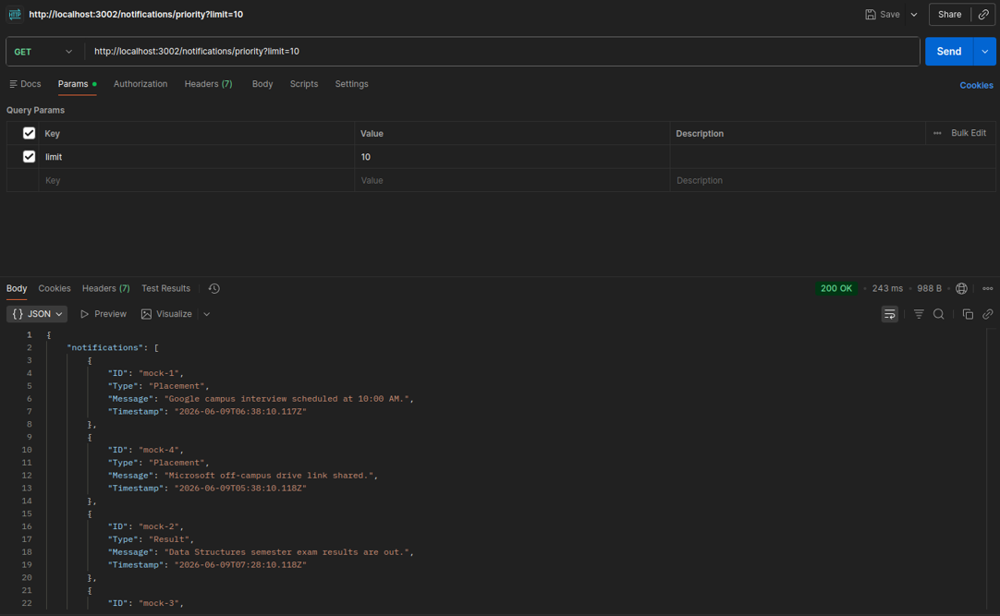

# Backend Microservices

Three Node.js/Express microservices built as part of backend development exercises.

1. **Vehicle Maintenance Scheduler** — An Express microservice that fetches depot and vehicle task data from external APIs and uses a 0/1 Knapsack dynamic programming algorithm to select the optimal set of maintenance tasks within available mechanic hours.

2. **Logging Middleware** — A reusable structured logging service that accepts log entries over HTTP with Bearer token authentication, supports multiple log levels, and provides retry logic for reliable log delivery across services.

3. **Notification App Backend** — A notification service that fetches notifications from an external source, assigns priority scores based on type (Placement, Result, Other) and recency, and returns them sorted by importance with pagination support.

## API Outputs

